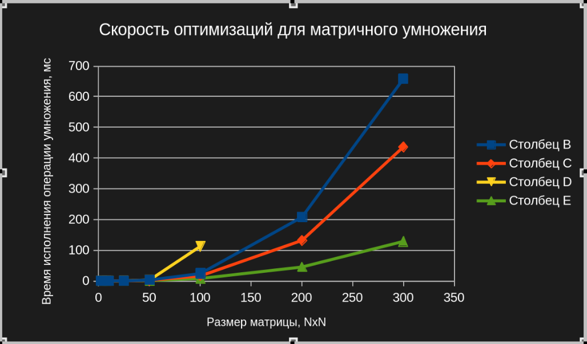
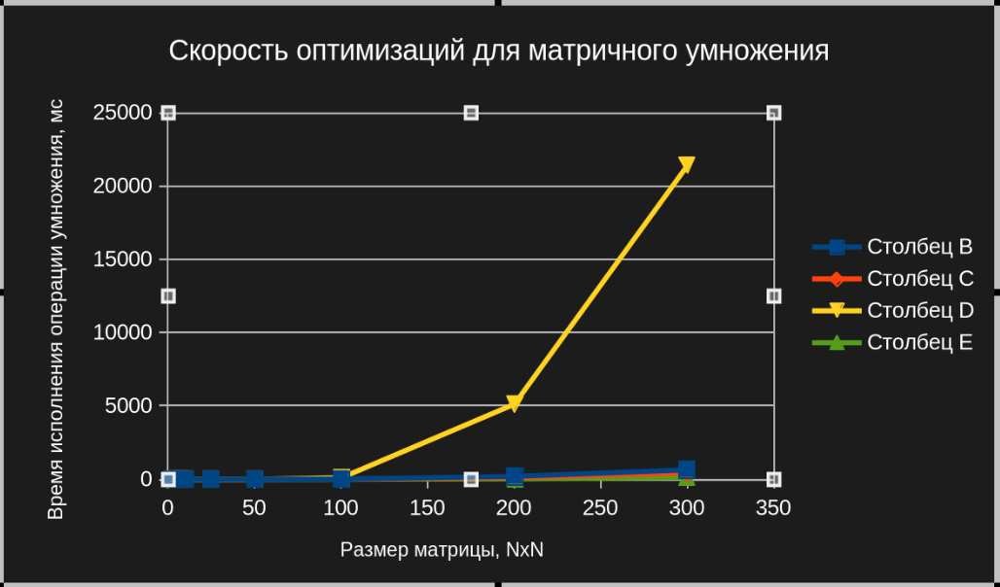
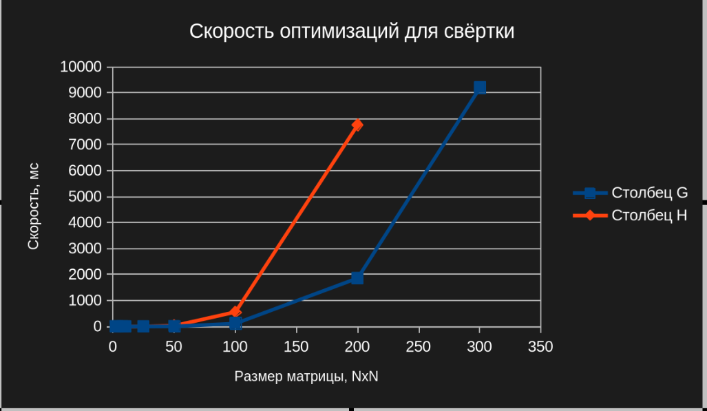

## Сравнение времени работы для оптимизаций операций с матрицами

### Для матричного умножения представлено 4 возможных варианта выполнения:

Столбец B - тривиальная реализация умножения

Столбец С - "кеш френдли" реализация

Столбец D - реализация тайлинг + кеш френдли

Столбец E - кеш френдли + векторные операции

### Убраны последние две точки тайлинг-умножения для сравнения других графиков:

 

### Полный график:

 

Как мы видим, реализация тайлинга критически сильно замедляет производительность умножения. С другой стороны, векторизация циклов сильно ускоряет выполнение операции.

### Оптимизация свёртки представлена методом Im2Col

Столбец G - тривиальная реализация

Столбец H - оптимизация Im2Col

 

Как мы видим, наша оптимизация сильно замедлила работу программы) Вероятно, дело в реализации самой функции Im2Col, так как немного не до конца понятно, как более эффективно реализовать трансформацию в матрицу.